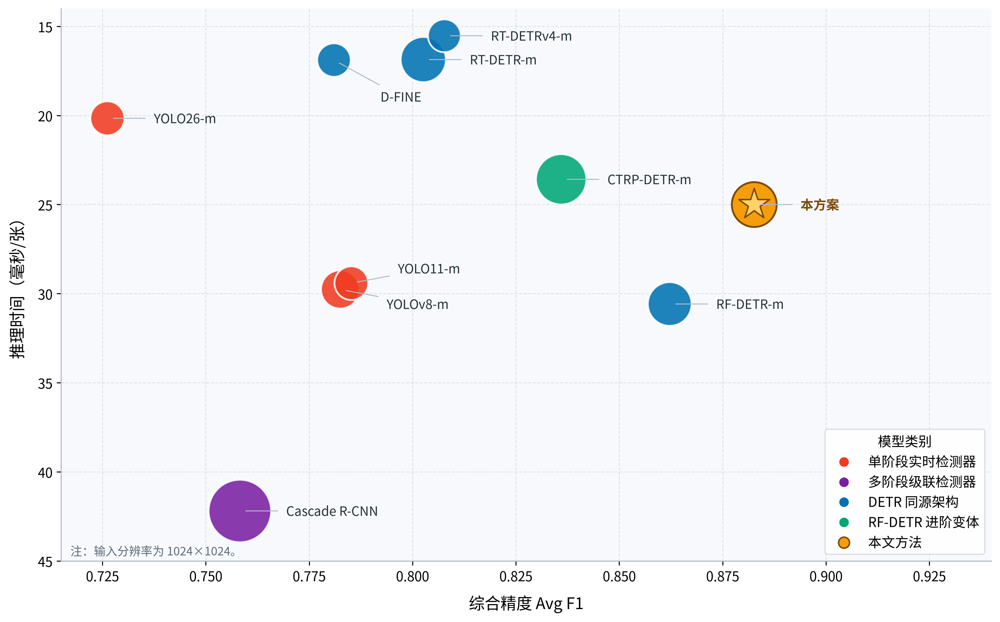
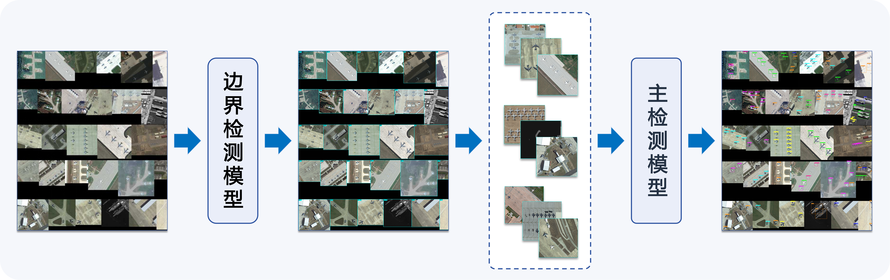
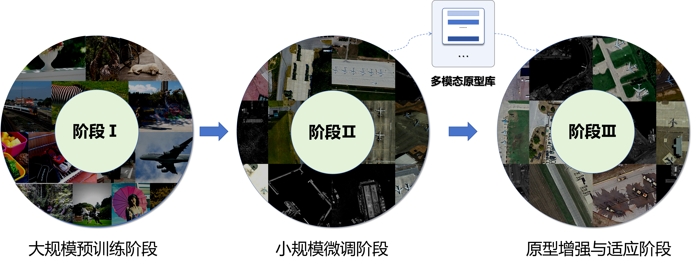
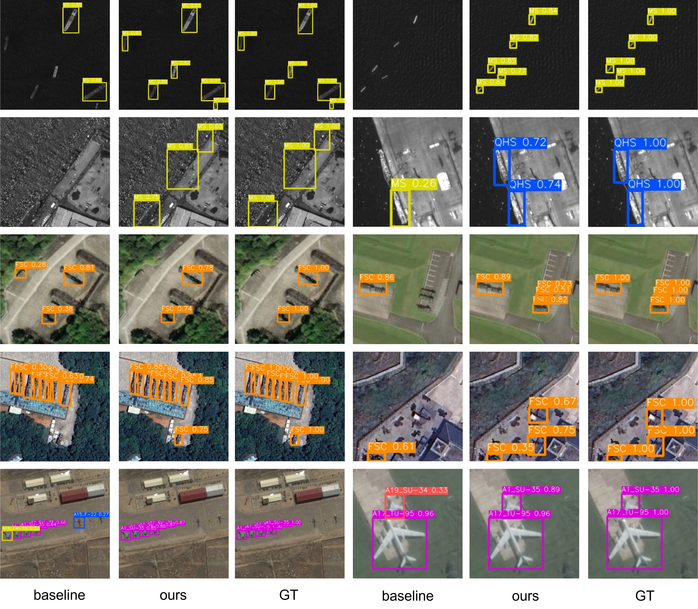

# 面向不均衡小样本遥感目标检测的 RF-DETR

本项目面向光学遥感卫星影像中的陆上目标检测识别任务，以 RF-DETR 为检测基座，针对
小样本、类别不均衡、细粒度类别混淆和复杂背景虚警进行改进。项目提供从训练、评估、
单图推理到比赛 Docker 交付的完整代码。

在包含 25 类目标（4 类舰船、20 类飞机、1 类发射车）的遥感检测数据集上，本方案与 9 种主流检测方法进行了严格对比。结果如下：



## 1. 任务与目标

核心任务：面向光学遥感卫星影像中的陆上时敏目标（如航母、两栖舰、发射车及各类飞机），在样本总量有限且类别分布高度不均衡的约束下，设计一套不依赖大规模标注数据的高效检测识别方案。 

本项目使用的数据集包含 25 类目标（4 类舰船、20 类飞机、1 类发射车），在真实业务场景中面临以下四大结构性瓶颈，这也是本方案着力解决的核心问题：

- 极端类别不均衡（长尾分布）：头部类别（飞机）占总样本的 74.5%，而尾部类别（发射车）仅占 1.8%，最大类与最小类样本比约为 19:1。模型极易偏向头部类，导致航母、发射车等稀有目标出现严重的召回不足与特征漂移。

- 异源数据模态差异：舰船图像为全色（PAN）灰度成像（单通道），而飞机与发射车为 RGB 彩色成像（三通道）。异源模态导致特征分布失配，要求模型具备跨模态对齐能力。 

- 细粒度类别边界模糊：不同舰船型号之间、部分飞机型号之间，以及目标与港口设施、阴影等“类目标”背景之间存在极强的外观相似性，极易引发类别误判。 

- 复杂背景虚警突出：港口码头密集停泊、发射车置于草地林地等场景下，背景纹理高度结构化，检测器容易以高置信度将背景预测为前景，导致虚警率居高不下。

项目的优化目标是提高稀有类别和易混类别的召回率，降低背景虚警，并在目标硬件上完成
大图快速推理。最终指标以实际数据集和评测环境中的结果为准。

## 2. 总体技术路线

### 2.1 RF-DETR 检测基座

本方案以 RF-DETR（两阶段 DETR 变体） 为检测基座，针对上述四大挑战，创新性地引入了“一个多模态原型锚点、两处在线引导、三类训练约束”的核心机制，构建了从特征提取到背景抑制的完整闭环。 


检测基座：本方案以 RF-DETR 为检测基座。RF-DETR 是基于 LW-DETR 思路的两阶段 Transformer 检测器，整体流程为：输入图像经骨干网络提取多尺度特征，通过两阶段候选查询选择得到固定数量的初始查询，再由 Transformer 解码器逐层细化目标位置与类别，最终输出分类结果与边界框。 在骨干网络选择上，RF-DETR 采用窗口化 DINOv2 ViT，其自监督预训练赋予了特征较强的泛化能力，有助于缓解遥感影像与自然图像之间的域差异；同时，通过窗口注意力与全局注意力的交错设计，在保持全局上下文建模能力的前提下有效降低了高分辨率影像的计算开销。编码器输出的多级特征经投影层融合后得到记忆特征（Memory），作为后续查询选择与解码器交叉注意力的输入，也为本文多模态原型增强模块的引入提供了统一的特征接口。 训练时采用匈牙利匹配进行预测-标注一对一分配，联合优化分类焦点损失、L1 回归损失与 GIoU 损失，并在多级解码层上施加密集监督。

```text
输入图像
   |
   v
DINOv2 骨干 + 多尺度投影
   |
   v
两阶段候选查询选择（位置提议）
   |
   v
Transformer 解码器（自注意力 + 可变形交叉注意力）
   |
   v
分类头 + 边界框回归头
   |
   v
目标类别、置信度和边界框
```

### 2.2 一个锚点、两处引导、三类约束

在 RF-DETR 基础上，本项目引入多模态原型增强。整体可以概括为“一个原型锚点、两处
在线引导、三类训练约束”。


**一个原型锚点：多模态类别原型库**

1. 使用训练数据和骨干特征，在目标框区域提取视觉特征，并按类别进行余弦聚类，得到
   能表示不同角度、尺度和外观的多个视觉子原型。

2. 使用 CLIP 文本编码器编码类别名称和遥感场景提示词，得到文本原型。

3. 将视觉原型与文本原型投影到统一空间并融合。原型库在训练和推理中作为冻结的类别
   先验锚点使用，不参与在线更新。

**两处在线引导**

- **位置引导**：在两阶段查询选择前，计算记忆特征与类别原型的相似度和类别间隔，
  对原有目标性分数做残差修正，使更可能属于目标类别的特征进入解码器，同时保留基座
  模型的目标性判断。
- **内容引导**：对已经选中的查询，根据其最相关的类别和原型子槽位提取上下文，通
  过置信度控制的门控残差注入查询内容，让解码器获得更明确的类别和形态先验。

**三类训练约束**

- **原型辅助分类损失**：只对匈牙利匹配到的前景特征进行类别监督，并按类别均衡，
  让原型打分分支真正学习类别信息。
- **语义加权监督对比学习（SSCL）**：使用解码器末层的匹配前景查询作为特征，在投影
  空间中拉近同类样本；对 CLIP 语义上更相近的异类施加更强的分离压力，重点处理细粒
  度混淆类别。
- **难负样本抑制**：从未匹配查询中筛选与标注框处于指定 IoU 范围、且前景得分较高的
  候选，将其作为“像目标但不是目标”的背景样本，直接抑制其前景响应，减少港口、阴
  影和局部结构造成的虚警。

三类约束共同形成总训练目标：检测损失负责基本定位和分类，原型损失负责语义锚定，
SSCL 负责易混类别分离，难负样本损失负责前景与背景边界建模。

### 2.3 大图推理路线

对大幅面影像，部署流水线先使用边界模型定位可能包含目标的区域，再将区域切分为带
重叠的小块送入主检测模型。各裁块的预测框会映射回原图坐标，并通过 NMS 等后处理合
并重叠结果。这样可以保留小目标细节，同时避免整幅图缩放造成的目标尺寸过小。



## 3. 环境安装

要求 Python `>=3.10`。推荐使用仓库声明的 `uv` 环境：

```bash
pip install uv
uv sync --all-groups
```

GPU 训练和部署需要可用的 CUDA、PyTorch 以及对应驱动。Albumentations/Kornia 等增强依
赖属于可选组件，按 `pyproject.toml` 中的 extra 安装。

## 4. 数据集准备

训练入口支持 YOLO 和 COCO 数据格式。项目实验主要使用 YOLO 目录布局，示例结构如下：

```text
dataset/
├── train/
│   ├── images/
│   └── labels/
├── valid/                 # 也可使用 val/
│   ├── images/
│   └── labels/
└── test/                  # 可选
    ├── images/
    └── labels/
```

标注文件使用归一化的 YOLO 格式：`class_id x_center y_center width height`。类别编号需
与训练配置和原型/语义矩阵中的类别顺序一致。数据集根目录通过 YAML 的
`train.dataset_dir` 或 `test.dataset_dir` 指定，建议使用绝对路径或相对项目根的稳定路径。

## 5. 训练

### 5.1 统一 YAML 入口

训练采取模块化的配置方式，训练脚本会读取 YAML，构造模型并将 `train:` 段参数透传给 `model.train(**kwargs)`。

项目建议采用三阶段策略：



 - 阶段I：大规模预训练（基础能力）。直接加载 RF-DETR 在 Objects365 上的官方预训练权重（我们选用 Medium 尺寸），建立通用目标检测基础能力。

 - 阶段II：遥感域适配微调（域迁移）。在竞赛数据集（25类）上对基座模型做全量微调 120 轮。该阶段暂不引入任何原型模块，避免新增随机初始化参数干扰域适配。此阶段完成模型从通用域到遥感域的迁移，同时为后续原型构建提供收敛的特征空间。

```bash
uv run python src/scripts/train.py \
  -c configs/experiments/train_stage1_medium.yaml
```

 - 阶段III：原型增强与适应（小样本辨识）。基于阶段II收敛的最佳域适配模型，离线构建多模态原型库（每类 M=10 槽位），随后进行 20 轮微调： 冻结策略：冻结骨干网络与编码器，仅解冻解码器末尾两层、归一化层与分类头；开启模块：全程启用特征选择增强、语义信息增强、原型辅助分类损失、SSCL与难负样本抑制

```bash
uv run python src/scripts/train.py \
  -c configs/experiments/train_stage2_medium.yaml
```

每个实验的冻结范围、学习率、损失权重、启动轮次和难例筛选阈值都应以实际 YAML 为准，
不要仅凭实验目录名称推断配置。

### 5.2 训练产物

训练输出目录通常包含：

- `checkpoint_best_total.pth`：按验证指标选出的模型权重；
- `checkpoint*.pth`：周期性或 EMA 权重；
- `training_config.json`：本次运行的完整生效配置；
- `metrics.csv`、TensorBoard 日志和验证结果：用于分析损失、mAP、召回率及原型/难例
  监控指标。

## 6. 评估与推理

### 6.1 批量评估

统一评估入口会执行批量推理、指标计算、混淆矩阵以及 FP/FN 分析。使用通用 SHWX 配置：

```bash
uv run python src/scripts/test.py \
  -c configs/experiments/train_tests/test_shwx.yaml
```

也可以用位置参数覆盖 checkpoint，或用 `--set` 覆盖测试参数：

```bash
uv run python src/scripts/test.py \
  -c configs/experiments/train_tests/test_shwx.yaml \
  /path/to/checkpoint_best_total.pth \
  --set test.conf_threshold=0.25 \
  --set test.save_fp_fn=true
```

评估配置中的常用字段包括：

- `checkpoint`、`dataset_dir`、`output_dir`：权重、数据和结果目录；
- `resolution`、`batch_size`、`num_workers`、`device`：推理资源配置；
- `conf_threshold`、`class_conf_thresholds`：全局和逐类置信度阈值；
- `save_fp_fn`、`save_yolo_preds`：是否保存误检/漏检可视化和 YOLO 预测文件；
- `large_image_min_side`、`boundary_checkpoint` 等：是否启用大图切块分支。

评估输出包括总体和逐类指标、混淆矩阵、FP/FN 样本以及大图推理耗时统计。模型选择不
应只看总体 mAP，还应结合稀有类召回、易混类别精确率和虚警数量。

### 6.2 单图或目录推理

预测入口对单张图片或整个目录生成 YOLO 格式预测文件和可视化结果：

```bash
uv run python src/scripts/predict.py \
  -c configs/experiments/predict_shwx.yaml
```

配置中的 `predict.image` 指向图片或目录，`predict.output_dir` 指定输出位置。默认输出：

```text
output_dir/
├── labels/                 # class_id cx cy w h confidence
├── visualization/          # 预测框、类别和置信度
└── label_comparison/       # 开启 label_comparison 后生成
```


## 7. 部署

### 7.1 导出主检测和边界模型

比赛大图流程需要主检测模型和边界检测模型两个输入分支。仓库提供批量导出脚本：

```bash
uv run python src/scripts/onnx/export_shwx_onnx.py \
  --detector-checkpoint /path/to/detector.pth \
  --boundary-checkpoint /path/to/boundary.pth \
  --output-dir deploy/models \
  --detector-resolution 1024 \
  --boundary-resolution 704
```

导出的 ONNX 支持动态 batch、固定空间分辨率，并分别生成主检测和边界检测模型。通用
模型也可以通过 `model.export(format="onnx")` 导出；TensorRT 需要额外安装对应依赖，
详见 [docs/learn/export.md](docs/learn/export.md)。

### 7.2 准备交付资产

交付目录位于 `deploy/`，资产准备脚本会检查并复制模型、原型工件和运行时文件：

```bash
# 默认准备 ONNX 交付资产
uv run python deploy/prepare_delivery_assets.py

# 使用 PyTorch 后端时，额外准备 checkpoint、原型工件和精简运行时
uv run python deploy/prepare_delivery_assets.py --include-pytorch-runtime
```

纯 ONNX 运行时不加载 `.pth`、`.pt` 或 ProtoGuidance 原型文件，原型融合和类别数已经固
化在 ONNX 图中。使用 ONNX 后端时，`deploy/app/competition/configs/submission.yaml` 的
`main` 和 `boundary` 角色都应设置为 `backend: onnx`，模型字段只填写
`deploy/models/` 内的文件名。

### 7.3 构建和运行 Docker

```bash
cd deploy
docker build \
  --platform linux/amd64 \
  --provenance=false \
  --sbom=false \
  -t rfdetr-shwx:local .
```

使用赛事规定的输入输出参数运行容器：

```bash
mkdir -p test-input test-output
cp /path/to/test-image.jpg test-input/

docker run --rm \
  --gpus '"device=0"' \
  --network none \
  -v "$PWD/test-input:/input:ro" \
  -v "$PWD/test-output:/output" \
  rfdetr-shwx:local \
  --input /input \
  --output /output
```

程序必须在 `/output/result.json` 生成包含状态、图像尺寸、时间戳和目标列表的结果文件。
容器启动时会检查启用角色的 GPU 后端，ONNX Runtime 必须能发现
`CUDAExecutionProvider`，不能静默回退到 CPU。

### 7.4 交付前检查

宿主机可用以下脚本评估容器结果，并可选生成可视化：

```bash
uv run python src/scripts/eval_deploy_result.py \
  --result deploy/test-output/result.json \
  --labels /path/to/yolo/labels \
  --images /path/to/images \
  --visualize \
  --vis-dir deploy/test-output/viz
```

