# 4.2 训练过程与收敛分析

阶段 I 使用 Roboflow 训练的 RF-DETR Medium 大规模预训练权重。本节仅分析阶段 II 的小规模领域微调和阶段 III 的原型增强与适应过程。

## 4.2.1 训练资源消耗

两阶段均采用单卡训练，资源统计如表 4-1 所示。阶段 II 的训练轮数由 `output/0825baseline/metrics.csv` 中的 100 个 Epoch 记录确定，阶段 III 的训练轮数由 `output/0825发射车虚警抑制/0826原型前向加难负样本抑制/metrics.csv` 中的 20 个 Epoch 记录确定。

| 阶段 | 训练目标 | Epoch | 单卡耗时 | 峰值显存 |
| --- | --- | ---: | ---: | ---: |
| II | 小规模领域微调 | 100 | 4.0 h | 20 GB |
| III | 原型增强与适应 | 20 | 0.8 h | 5 GB |
| 合计 | 阶段 II + 阶段 III | 120 | 4.8 h | 20 GB |

阶段 II 与阶段 III 均在单卡环境完成，累计训练时长约 4.8 h。阶段 III 在阶段 II 权重基础上完成原型增强适应，仅需约 0.8 h，峰值显存约 5 GB；全流程峰值显存由阶段 II 决定，为约 20 GB。

## 4.2.2 阶段 II 与阶段 III 收敛曲线

阶段 II 和阶段 III 的验证指标分别来自 `output/0825baseline/metrics.csv` 与 `output/0825发射车虚警抑制/0826原型前向加难负样本抑制/metrics.csv`。其中 `val/F1` 是船舶、飞机和车辆三大类 F1 的等权平均，`val/recall` 为验证集总体召回率，`val/mAP_50` 和 `val/mAP_50_95` 分别表示 IoU=0.50 与 IoU=0.50:0.95 下的平均精度。各指标分别绘制，图片均为独立文件；纵轴根据实际数据范围设置，不从 0 起始，以突出收敛阶段的细微变化。

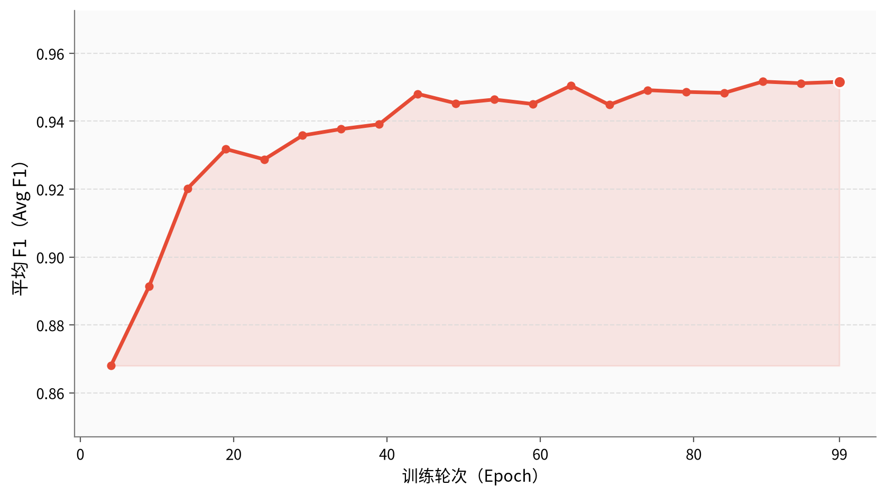

图 4-1 阶段 II 验证集平均 F1 随训练轮次变化

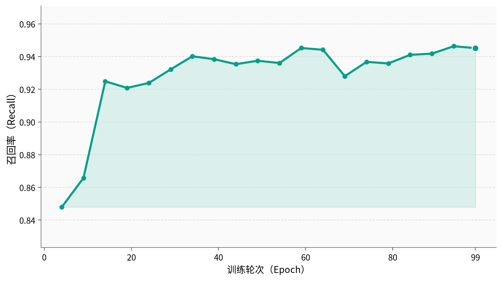

图 4-2 阶段 II 验证集召回率随训练轮次变化

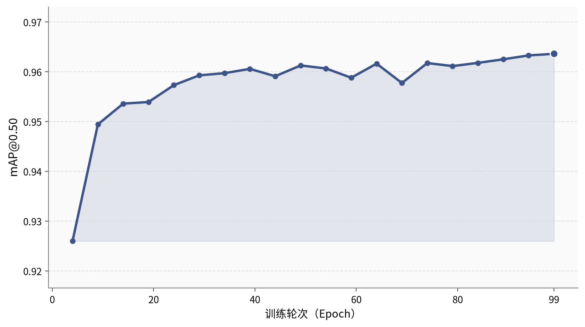

图 4-3 阶段 II 验证集 mAP@0.50 随训练轮次变化

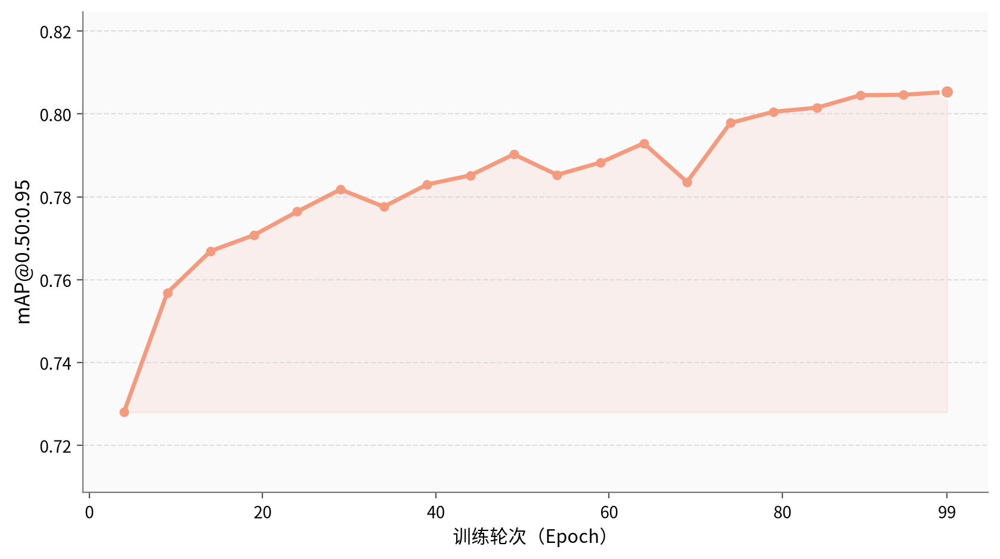

图 4-4 阶段 II 验证集 mAP@0.50:0.95 随训练轮次变化

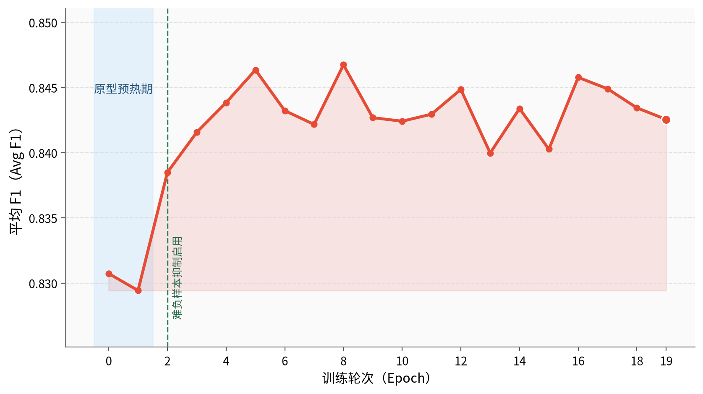

图 4-5 阶段 III 验证集平均 F1 随训练轮次变化

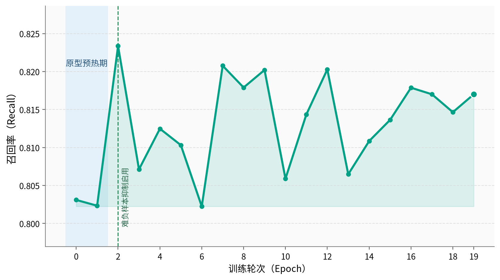

图 4-6 阶段 III 验证集召回率随训练轮次变化

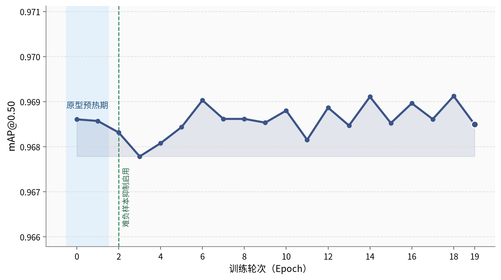

图 4-7 阶段 III 验证集 mAP@0.50 随训练轮次变化

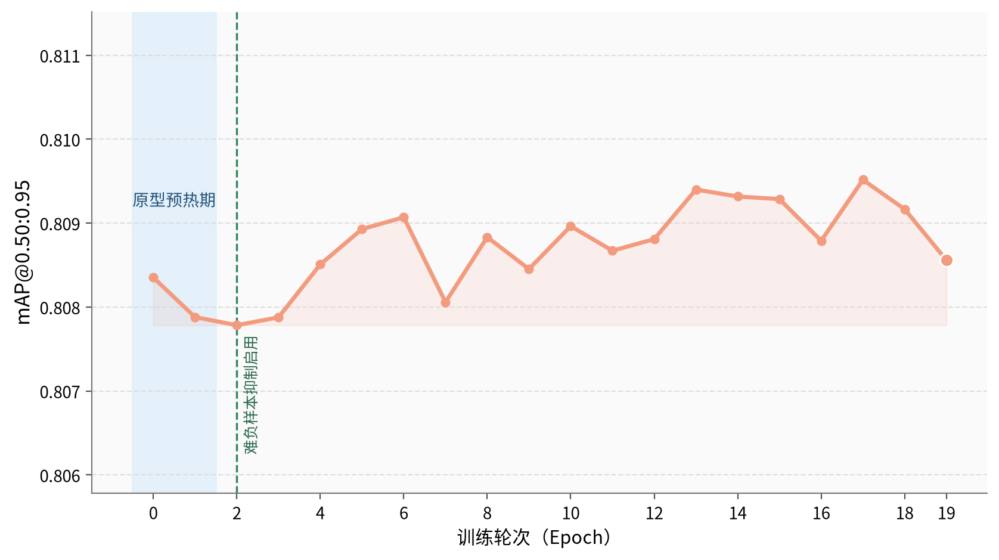

图 4-8 阶段 III 验证集 mAP@0.50:0.95 随训练轮次变化

图中 Epoch 0–1 的浅色区域表示原型预热期，Epoch 2 的竖线表示难负样本抑制开始参与训练。原型模块在前 2 轮完成预热，模型自 Epoch 2 起进入稳定收敛区间。Epoch 2–19 的 Avg F1 均值为 0.8431、标准差为 0.0021，Recall 均值为 0.8140、标准差为 0.0057。最佳 Avg F1 为 0.8458，出现在 Epoch 8，最终 Epoch 19 的 Avg F1 为 0.8426。整体曲线未出现持续性下降，表明原型注入后的训练过程稳定，未观察到明显过拟合。

## 4.2.3 损失分解与辅助项有效性

损失分解与收敛曲线使用相同的阶段 III 训练记录，即 `output/0825发射车虚警抑制/0826原型前向加难负样本抑制/metrics.csv`。每张图使用完整 20 轮训练数据，分别展示实际启用的基础检测损失、语义对比学习损失和难负样本抑制损失。图中不显示标题，纵轴以 LaTeX 形式标记对应损失项。

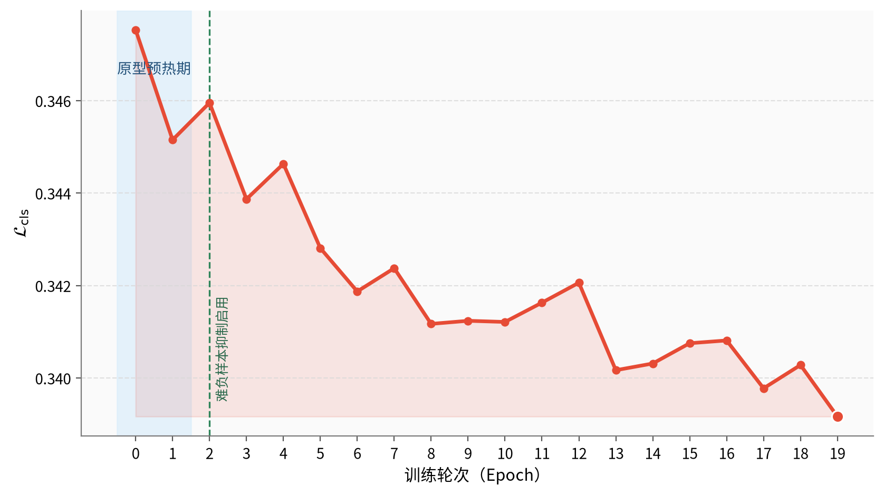

图 4-9 分类损失随训练轮次变化

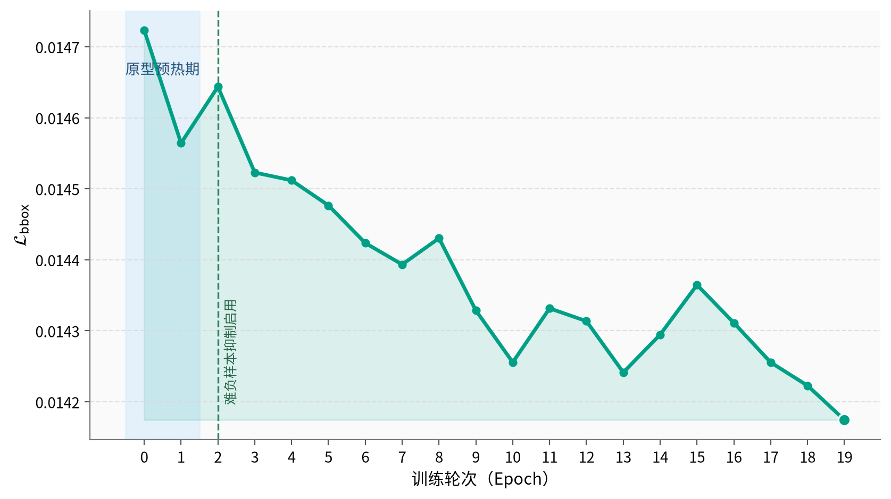

图 4-10 边界框回归损失随训练轮次变化

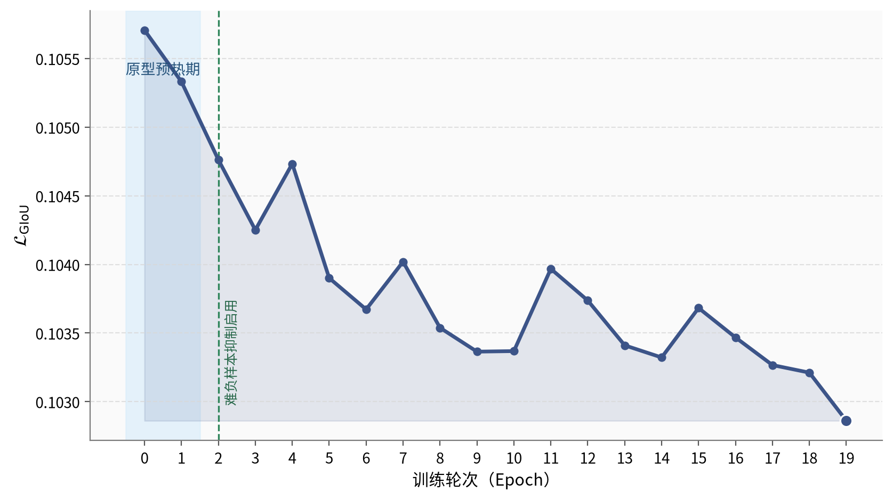

图 4-11 广义交并比损失随训练轮次变化

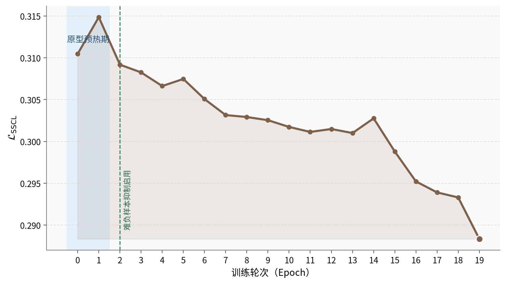

图 4-12 语义对比学习损失随训练轮次变化

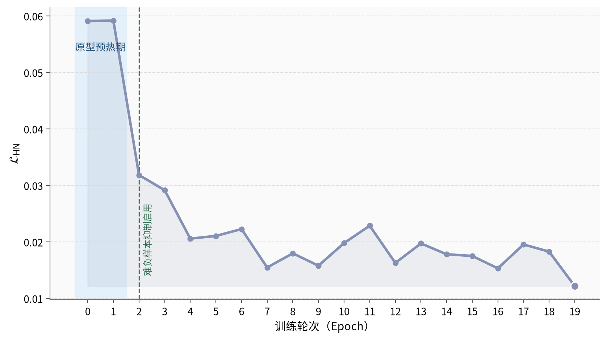

图 4-13 难负样本抑制损失随训练轮次变化

20 轮训练内，分类损失由 0.3475 降至 0.3392，边界框回归损失由 0.01472 降至 0.01417，GIoU 损失由 0.10571 降至 0.10286，均保持稳定下降。语义对比学习损失在 0.30 附近小幅波动，符合持续维持类间判别约束的训练行为；难负样本抑制损失在启用后由 0.03184 降至 0.01219，说明模型逐步降低了高风险背景候选的前景响应。最终阶段 III 未启用 `L_dense` 和 `L_proto`，故不展示这两类损失。
